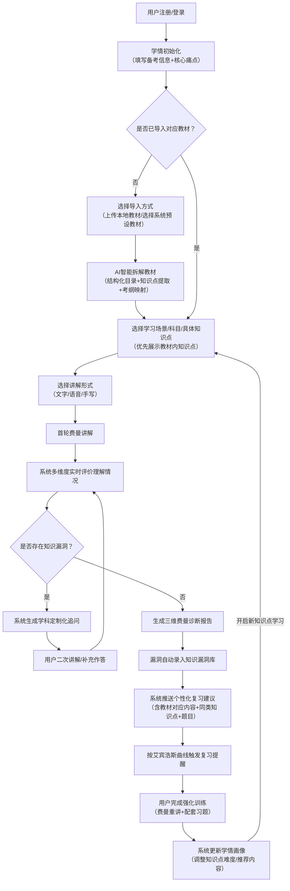
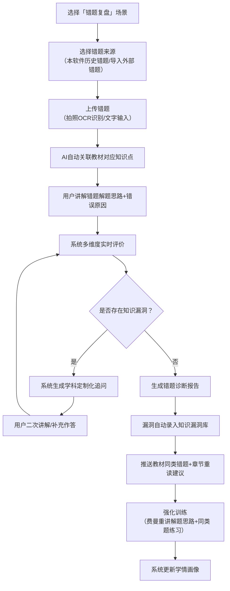
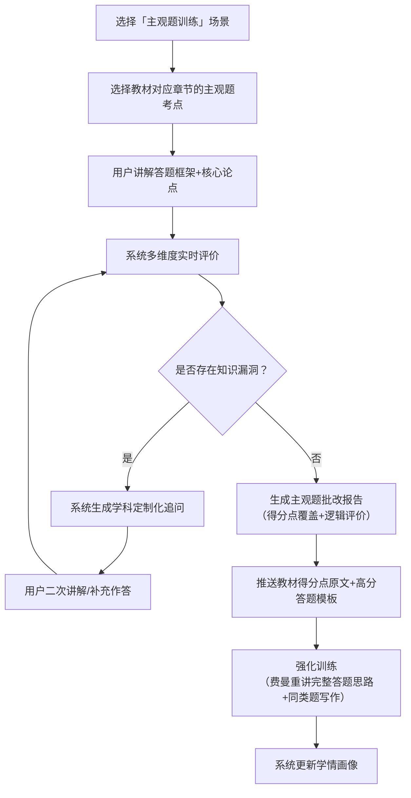

# 费曼伴学智能体\-第二周\-功能流程V1\.3\.1

## 1\. 核心业务流程图

## 2\. 功能清单

### 2\.1 优先级定义

- P0（核心必做）：支撑费曼学习核心闭环的基础功能，无此则产品无法满足考研用户核心需求

- P1（重要）：提升用户体验、强化考研场景适配性的扩展功能

- P2（进阶）：长期优化、提升产品竞争力的增值功能

### 2\.2 功能清单详情

|功能模块|功能点|优先级|功能描述|
|---|---|---|---|
|  账号与学情 |注册 / 登录|P0|仅支持手机号 \+ 验证码、账号密码登录；第三方登录（微信 / QQ）列为后续迭代功能|
||学情初始化|P0|填写报考学科、备考阶段、备考类型、核心痛点，生成初始学情画像|
|教材导入与解 |多格式资料导入|P0|支持两种导入方式： 1\. 上传本地教材：PDF、Word、TXT、Markdown、扫描件图片，单文件≤100MB 2\. 选择系统预设教材：按学科 / 专业方向分类，支持搜索，覆盖主流考研指定教材|
||教材结构化解析|P0|自动识别教材章节 / 小节 / 知识点层级，生成可交互目录；扫描件通过 *OCR（光学字符识别）* 转可编辑文本|
||教材知识点与考纲映射|P0|将导入教材的知识点与对应学科考研大纲匹配，标注高频考点、考察题型、近 5 年考察频率|
||教材易错点自动标注|P0|结合考研真题数据，标注教材中易混淆概念、易错题对应的知识点位置|
||多教材管理|P1|支持同时导入多本教材（如政治教材 \+ 专业课教材），可切换不同教材的知识点库|
|内容选择|学习场景选择|P0|提供概念理解、错题复盘、主观题训练 3 大核心场景入口|
||知识点选择|P0|优先展示当前激活教材的知识点列表，支持按章节 / 考点频率筛选；未导入教材时提供通用考研知识点库|
|用户讲解|多模态讲解输入|P0|支持 3 种讲解形式： 1\. 文字：分段编辑、草稿保存 2\. 语音：实时转写、暂停续讲 3\. 手写：拍照上传手写稿 / 公式 / 思维导图，OCR 识别解析|
|AI 交互 |实时多维度评价|P0|讲解过程中实时检测概念错误、逻辑跳跃、要素遗漏，生成即时评价|
||学科定制化追问|P0|数学重推导、政治重逻辑、专业课重概念本质，生成 2\-5 轮连续追问|
|诊断输出|三维费曼诊断报告|P0|生成「小白刁难点 \- 用户回应漏洞 \- 深度剖析」三维报告，关联教材原文溯源|
|复习闭环|知识漏洞库管理|P0|自动录入漏洞，标注**漏洞类型**（概念错误 / 逻辑跳跃 / 要素遗漏 / 前提省略 / 表达模糊 / 适用条件混淆）、关联教材页码、考察频率|
||个性化复习建议|P0|推送教材对应章节的重读指引、同类知识点讲解、教材配套练习题|
||SRS 间隔复习|P0|基于艾宾浩斯曲线设置 1/3/7/14/30 天复习节点，推送漏洞重讲 \+ 强化题|
|学情迭代 |学情画像更新|P0 |根据训练结果更新用户知识点掌握度、薄弱项、学习节奏，调整后续推荐内容|
|错题复盘|错题导入与管理|P1|支持两种错题来源： 1\. 本软件内做题产生的历史错题 2\. 用户手动导入的外部错题（拍照 / 文字输入）|

## 3\. 完整业务流程分步详解

### 3\.1 步骤 1：用户注册 / 登录（P0）

- **输入**：手机号 \+ 验证码、账号密码

- **功能要求**：

    1. 支持游客模式浏览核心功能，但无法保存学习记录和导入教材；

    2. 登录后自动同步历史学习数据、已导入教材和知识漏洞库；

    3. 暂不支持微信、QQ 等第三方登录，预留接口供后续迭代。

- **输出**：进入个人学习主页

### 3\.2 步骤 2：学情初始化（P0）

- **输入**：

    1. 基础信息：报考学科（公共课 \+ 专业课）、备考阶段（基础 / 强化 / 冲刺）、备考类型（应届 / 二战 / 在职）；

    2. 核心痛点：从预设选项（概念理解困难 / 输出薄弱 / 知识碎片化 / 盲目刷题 / 自律性差）中选择 1\-3 项。

- **功能要求**：

    1. 基于学情生成初始学习建议，如 "基础阶段跨考用户，建议优先导入目标院校指定教材，重点进行概念理解训练"；

    2. 自动推荐对应学科的系统预设教材列表，支持一键选择导入。

- **输出**：初始学情画像 \+ 教材导入引导页

### 3\.3 步骤 3：导入教材 / 学习资料（P0）

- **导入方式选择**：

    1. **选择系统预设教材**：

        - 按学科→专业方向→教材名称三级分类展示，支持关键词搜索；

        - 包含主流考研指定教材、官方大纲解析、历年真题解析；

        - 选择后自动完成解析，无需上传文件。

    2. **上传本地教材**：

        - 前期不完成，视乎后期节奏决定

        - 输入格式要求：

            |            资料类型|            支持格式|            考研专属限制|
            |---|---|---|
            |            文档类|            PDF、Word\(\.docx\)、TXT、Markdown|            优先支持考研指定教材、官方大纲解析、历年真题解析|
            |            图片类|            JPG、PNG、WEBP|            支持教材手写笔记拍照上传，自动识别手写内容|

- **处理逻辑**：

    1. 上传后自动进行格式校验和去重，失败时提示具体原因（如 "该教材已导入"、"扫描件清晰度不足"）；

    2. 优先解析教材的目录结构，生成可点击的章节树；

- **异常分支**：

    - 用户跳过导入：提示 "未导入教材将使用通用考研知识点库，建议导入目标院校指定教材以获得更精准的训练"，进入通用知识点选择页面；

    - 教材解析失败：提供 "手动标记章节" 功能，支持用户手动划分知识点范围。

- **输出**：教材结构化目录 \+ 解析完成提示（"已成功解析《XXX》，提取核心知识点 128 个，标注高频考点 45 个"）

### 3\.4 步骤 4：AI 智能拆解教材知识点（P0）

- **输入**：用户选中的教材章节范围 \+ 学情画像中的学科 / 备考阶段

- **处理逻辑**：

    1. 基于 RAG 技术将教材内容切片为 "200\-500 字 / 个" 的知识点单元，保留章节层级；

    2. 每个知识点标注：教材页码、考纲要求（了解 / 掌握 / 熟练运用）、考察题型、近 5 年考察频率；

    3. 自动关联知识点间的逻辑关系，生成**教材知识图谱**（P1 功能）。

- **输出**：教材专属知识点列表（按章节 / 考点频率排序） \+ 易错点标注

### 3\.5 步骤 5：选择学习场景 / 科目 / 具体知识点（P0）

- **输入**：用户选择的学习场景（概念理解 / 错题复盘 / 主观题训练）、科目、知识点

- **功能要求**：

    1. 优先展示当前激活教材的知识点，标注 "高频考点"、"易错题对应" 标签；

    2. **错题复盘场景**：支持选择本软件历史错题或手动导入外部错题（拍照 / 文字），AI 自动关联教材对应知识点；

    3. 基于学情画像推荐优先学习的知识点，如 "根据你的痛点，推荐先学习『剩余价值』（高频考点，跨考易混淆）"。

- **输出**：进入费曼讲解准备页面

### 3\.6 步骤 6\-15：费曼训练与复习闭环

#### 步骤 6：选择讲解形式（P0）

- **输入**：用户选择讲解形式（文字 / 语音 / 手写）

- **功能要求**：

    1. **文字讲解**：支持分段编辑、实时保存草稿、基础格式排版（加粗 / 分点）；

    2. **语音讲解**：支持实时转写、暂停 / 续讲、语音回放，转写结果可编辑；

    3. **手写讲解**：支持拍照上传手写讲解稿、数学公式推导、知识框架图，系统通过 OCR 识别手写内容并解析语义，支持用户在手写内容上添加批注标注重点。

- **输出**：进入讲解输入界面

#### 步骤 7：首轮费曼讲解（P0）

- **输入**：用户以选定形式讲解目标知识点 / 错题思路 / 主观题框架

- **功能要求**：

    1. 系统给出引导提示："请用给 8 岁小白讲明白的逻辑进行讲解，避免使用专业术语，尽量结合生活例子"；

    2. 支持随时暂停讲解、保存进度，下次登录可继续。

- **输出**：用户讲解内容（文字 / 转写文字 / 手写识别结果）

#### 步骤 8：系统多维度实时评价理解情况（P0）

- **输入**：用户首轮讲解内容 \+ 导入教材原文 \+ 考研考纲要求

- **功能要求**：

    1. 所有评价均基于用户导入的教材内容，避免与教材表述冲突；

    2. 实时检测 4 个核心维度的问题，生成量化评分与问题标记；

    3. 实时标记讲解中的问题点，如 "此处提到的 ' 剩余价值 ' 定义与教材第 32 页表述不一致"；

    4. **核心评价维度定义与评分标准（0\-10 分）**：

        |        评估维度|        核心定义|        评分区间说明|
        |---|---|---|
        |        理解深度|        衡量用户对知识点本质的掌握程度，是否存在概念错误、能否解释核心逻辑而非仅记忆结论|        0\-3 分：存在核心概念错误，仅能复述表面结论，无法解释原理；         4\-6 分：无核心概念错误，能解释基本原理，但无法说明逻辑推导过程；         7\-8 分：能准确解释核心逻辑，可说明原理的适用范围；         9\-10 分：能深度理解本质，可辨析相近概念、结合场景拓展应用|
        |        表达完整性|        衡量用户讲解是否覆盖知识点的全部核心要素（定义、原理、适用条件、关键结论等）|        0\-3 分：覆盖核心要素占比＜30%，遗漏关键前提或结论；         4\-6 分：覆盖 30%\-60% 核心要素，遗漏 1\-2 个重要内容；         7\-8 分：覆盖 60%\-90% 核心要素，仅遗漏次要细节；         9\-10 分：完整覆盖所有核心要素，无重要遗漏|
        |        逻辑连贯性|        衡量用户讲解的逻辑是否清晰，是否存在前后矛盾、逻辑跳跃、因果关系混乱|        0\-3 分：逻辑混乱，前后表述矛盾，无法形成完整逻辑链；         4\-6 分：逻辑基本通顺，但存在明显逻辑跳跃，需补充中间环节才能理解；         7\-8 分：逻辑连贯，因果关系清晰，仅存在少量非关键细节跳跃；         9\-10 分：逻辑严密，层层递进，因果关系明确，无任何逻辑漏洞|
        |        结构化能力|        衡量用户讲解的组织形式是否清晰，是否采用合理的结构（总分总、分点论述等）便于理解|        0\-3 分：无任何结构，内容杂乱无章，无法区分主次；         4\-6 分：有基础结构，但分点不清晰，主次混淆；         7\-8 分：结构清晰，分点合理，主次明确；         9\-10 分：采用最优讲解结构（如先例子后原理、先总述后分述），贴合 "教小白" 的表达逻辑|

    5. **完整评分示例（以《马克思主义基本原理概论》2025 版「剩余价值」知识点为例）**：

        - 用户首轮讲解："剩余价值就是工人创造的被资本家拿走的价值，比如工人干一天活赚 100 块，资本家赚 200 块，那 200 块就是剩余价值。"

        - 各维度得分与详细理由：

            |            评估维度|            得分|            评分理由|
            |---|---|---|
            |            理解深度|            4 分|            无核心概念错误，但未解释剩余价值的产生前提（劳动力成为商品）和本质（剩余劳动的凝结），仅用表面数字例子说明，未触及本质|
            |            表达完整性|            3 分|            仅覆盖 "剩余价值是被资本家占有的价值" 这一个要素，遗漏了劳动力商品、剩余劳动、资本主义生产过程等核心要素（覆盖占比≈20%）|
            |            逻辑连贯性|            5 分|            逻辑基本通顺，用例子支撑结论，但未说明 "为什么资本家能无偿占有这部分价值"，存在关键逻辑跳跃|
            |            结构化能力|            3 分|            无明确结构，仅零散陈述定义和例子，未区分主次，不符合 "教小白" 的递进式表达逻辑|

        - 实时评价标记：「概念遗漏：未说明剩余价值产生的前提是劳动力成为商品；逻辑跳跃：未解释资本家占有剩余价值的制度基础（生产资料私有制）」

- **输出**：实时评价标记 \+ 问题点汇总 \+ 初步维度评分

#### 步骤 9：系统生成学科定制化追问（P0）

- **输入**：实时评价结果 \+ 学科属性

- **功能要求**：

    1. 采用学科差异化追问逻辑：

        - 数学：侧重定理推导过程、适用条件、反例验证；

        - 政治：侧重原理逻辑关系、现实应用、得分点对应；

        - 专业课：侧重概念本质、相近概念辨析、案例应用；

    2. 生成 2\-5 轮连续追问，每轮追问针对一个具体漏洞；

    3. 追问时关联教材原文，如 "根据你导入的《政治经济学》教材第 32 页，剩余价值的产生需要什么前提条件？"。

- **输出**：逐条推送的追问内容 \+ 漏洞类型标注

#### 步骤 10：用户二次讲解 / 补充作答（P0）

- **输入**：用户针对追问的补充讲解 / 修正内容

- **功能要求**：

    1. 支持用户引用教材原文进行作答；

    2. 系统实时检测补充内容，若仍存在漏洞则继续追问，直至漏洞全部暴露或用户无法作答。

- **输出**：用户补充讲解内容

#### 步骤 11：生成三维费曼诊断报告（P0）

- **输入**：用户全部讲解内容 \+ 追问与回应记录 \+ 教材原文

- **功能要求**：

    1. 生成「小白刁难点 \- 用户回应漏洞 \- 深度剖析」三维报告：

        - **小白刁难点**：指零基础听众理解该知识点时最容易产生困惑、最常追问的核心问题，是衡量讲解通俗度与完整性的关键指标；

        - **用户回应漏洞**：精准列出用户讲解中的具体问题，标注漏洞类型；

        - **深度剖析**：分析漏洞对考研得分的影响，说明正确理解方式；

    2. 「教材溯源」模块，直接标注每个漏洞对应的教材页码和原文段落；

    3. 给出 4 维度量化评分（0\-10 分）及总分。

- **输出**：完整三维诊断报告 \+ 4 维度评分结果

#### 步骤 12：漏洞自动录入知识漏洞库（P0）

- **输入**：诊断报告中的漏洞清单

- **功能要求**：

    1. 自动录入漏洞，标注以下信息：漏洞类型、关联知识点、教材页码、考察频率、错误次数；

    2. 支持用户手动添加 / 删除漏洞，修改漏洞标注信息。

- **输出**：更新后的知识漏洞库

#### 步骤 13：系统推送个性化复习建议（P0）

- **输入**：漏洞清单 \+ 学情画像 \+ 教材内容

- **功能要求**：

    1. 优先推送贴合考研复习习惯的建议：

        - 教材重读指引："重读《XXX》教材第 X 页第 X 段，重点掌握 XXX 内容"；

        - 教材配套练习："完成教材课后习题第 X 题，巩固该知识点应用"；

    2. 推送同类知识点讲解和 3\-5 道考研真题风格的强化题；

    3. 给出后续学习优先级建议。

- **输出**：个性化复习建议清单 \+ 强化题推送

#### 步骤 14：SRS 间隔复习与强化训练（P0）

- **输入**：漏洞录入时间 \+ 艾宾浩斯遗忘曲线

- **功能要求**：

    1. 按 1 天、3 天、7 天、14 天、30 天的节点推送复习提醒；

    2. **强化训练完成标准**：采用 "费曼重讲 \+ 配套习题" 的组合模式：

        - 第一步：用户对漏洞知识点进行费曼重讲，系统评分≥8 分视为理解通过；

        - 第二步：完成系统推送的 3\-5 道同类配套题，全部答对视为应用通过；

        - 两步均通过则标记为 "已掌握"，否则调整复习节点为 1 天后重新推送。

- **输出**：复习提醒 \+ 强化训练任务

#### 步骤 15：系统更新学情画像（P0）

- **输入**：强化训练结果 \+ 诊断报告评分

- **功能要求**：

    1. 更新用户各知识点的掌握度（未掌握 / 初步掌握 / 熟练掌握）；

    2. 统计用户高频漏洞类型，调整后续追问和推荐策略；

    3. 生成 "教材掌握热力图"（P1 功能），直观展示各章节的掌握情况。

- **输出**：更新后的学情画像 \+ 教材掌握热力图

## 4\. 核心流程分支说明

### 4\.1 错题复盘场景分支（适配考研刷题需求）

### 4\.2 主观题训练场景分支（适配考研主观题高分需求）

---

## 附录 A：三大核心学习场景完整交互示例

### A\.1 概念理解场景：政治「剩余价值的产生」知识点学习

**Mock 用户信息**：二战跨考经济学，基础薄弱，核心痛点为「概念理解困难」，导入教材为《马克思主义基本原理概论》2025 版，当前处于基础阶段（3 月）。

**完整交互流程**：

1. **用户操作**：选择「概念理解」场景 → 选择教材章节「第 4 章 资本主义的本质及规律」→ 选择知识点「剩余价值的产生」

2. **系统引导**："请用给 8 岁小白讲明白的逻辑，讲解一下剩余价值的产生过程，尽量结合生活例子，避免使用专业术语。"

3. **用户首轮讲解（文字）**："剩余价值就是工人干活创造的钱里，被资本家拿走的那部分。比如工人一天生产 10 个杯子，每个卖 10 块，一共 100 块。工人工资是 30 块，剩下的 70 块就是剩余价值，被资本家赚走了。"

4. **系统实时评价**：

    - 初步评分：理解深度 4 分、表达完整性 3 分、逻辑连贯性 5 分、结构化能力 3 分

    - 问题标记：「概念遗漏：未说明劳动力成为商品是剩余价值产生的前提；逻辑跳跃：未解释为什么工人只能拿到 30 块工资」

5. **系统学科定制化追问（政治重逻辑与前提）**：

    - 追问 1："为什么工人一天创造了 100 块的价值，却只能拿到 30 块工资呀？资本家凭什么拿走剩下的钱呢？"

    - 追问 2："如果工人自己有杯子的生产设备，自己生产自己卖，还会有剩余价值吗？"

6. **用户二次讲解**："哦，因为资本家有工厂和机器（生产资料），工人没有，所以只能给资本家打工。工人的工资是养活自己的钱，也就是劳动力的价值。工人干活创造的价值比劳动力本身的价值多，多出来的就是剩余价值。如果工人自己有设备，就不用给资本家打工，剩余价值就自己拿了。"

7. **系统补充追问**："那劳动力的价值是怎么确定的呢？为什么是 30 块而不是 50 块呀？"

8. **用户补充作答**："劳动力的价值就是维持工人生活需要的钱，比如吃饭、租房、养孩子的钱，大概就是 30 块一天。"

9. **生成三维费曼诊断报告（核心片段）**：

    - **小白刁难点**：为什么资本家能无偿占有工人创造的价值？劳动力和劳动有什么区别？

    - **用户回应漏洞**：

        1. 要素遗漏：未区分 "劳动" 与 "劳动力" 两个核心概念

        2. 深度不足：未说明剩余价值产生于生产过程而非流通过程

    - **深度剖析**：混淆劳动与劳动力是考研政治高频易错点，该知识点在近 5 年真题中出现 3 次，多以选择题形式考查，若概念混淆会直接导致 2 分失分。

    - **教材溯源**：《马克思主义基本原理概论》2025 版第 32 页："劳动力成为商品，是货币转化为资本的前提"；第 33 页："剩余价值是雇佣工人所创造的并被资本家无偿占有的超过劳动力价值的价值"。

    - **最终评分**：理解深度 7 分、表达完整性 6 分、逻辑连贯性 7 分、结构化能力 5 分，总分 6\.25 分

10. **个性化复习建议**：

    - 教材重读：重读第 32\-34 页，重点掌握 "劳动力商品的特点" 和 "剩余价值的生产过程"

    - 强化练习：完成教材课后习题第 4 题（辨析 "劳动和劳动力的区别"）

    - 同类知识点：推送 "绝对剩余价值" 和 "相对剩余价值" 的概念讲解

11. **SRS 间隔复习提醒（1 天后）**：

    - 系统推送 APP 通知 \+ 站内消息："您有 1 个待复习知识点：剩余价值的产生（漏洞：劳动与劳动力概念混淆）"

12. **强化训练环节**：

    - **第一步：费曼重讲**：系统引导 "请重新讲解劳动与劳动力的区别，用生活例子说明"

    - 用户重讲："劳动力是工人干活的能力，就像你会做饭这个本事；劳动是你实际做饭的过程。资本家买的是工人的劳动力（做饭的本事），给的工资是养活工人的钱（买菜钱），但工人做饭（劳动）创造的价值（一顿饭的价格）比买菜钱多，多出来的就是剩余价值。"

    - 系统重讲评分：理解深度 9 分、表达完整性 8 分、逻辑连贯性 9 分、结构化能力 8 分，总分 8\.5 分（≥8 分，理解通过）

    - **第二步：配套习题**：系统推送 3 道同类选择题，用户全部答对（应用通过）

13. **学情画像更新**：

    - 标记「剩余价值的产生」为 "初步掌握"

    - 更新高频漏洞类型："概念区分不清" 占比下降 15%

    - 教材掌握热力图：第 4 章掌握度从 20% 提升至 45%

    - 后续推荐：优先学习 "绝对剩余价值的生产" 知识点

---

### A\.2 错题复盘场景：数学三「极限计算」错题分析

**Mock 用户信息**：应届数学三考生，核心痛点为「盲目刷题」，导入教材为《高等数学（同济第七版）》上册，当前处于强化阶段（8 月）。

**完整交互流程**：

1. **用户操作**：选择「错题复盘」场景 → 选择「导入外部错题」→ 拍照上传错题：

    > 题目：求极限 $\lim_{x \to 0} \frac{\sin x - x \cos x}{x^3}$
    > 用户原解答：$\lim_{x \to 0} \frac{\sin x - x \cos x}{x^3} = \lim_{x \to 0} \frac{x - x \cdot 1}{x^3} = \lim_{x \to 0} \frac{0}{x^3} = 0$
    > 正确答案：$\frac{1}{3}$
    > 
    > 

2. **系统操作**：OCR 识别错题内容 → 自动关联教材知识点「第 1 章 极限与连续」→ 「等价无穷小替换的适用条件」

3. **系统引导**："请讲解一下这道题的解题思路，以及你当时为什么会做错。"

4. **用户讲解**："我当时用了等价无穷小替换，sinx\\x，cosx\\1，所以分子变成 x\-x\*1=0，结果就是 0。但正确答案是 1/3，我不知道哪里错了。"

5. **系统实时评价**：

    - 初步评分：理解深度 3 分、表达完整性 4 分、逻辑连贯性 5 分、结构化能力 4 分

    - 问题标记：「概念错误：等价无穷小替换在加减法中不能直接使用；逻辑错误：忽略了等价无穷小的精度问题」

6. **系统学科定制化追问（数学重推导与适用条件）**：

    - 追问 1："等价无穷小替换的适用条件是什么？为什么加减法里不能直接用？"

    - 追问 2："如果把 sinx 和 cosx 展开成泰勒公式，会得到什么结果？"

    - 追问 3：" 如果把题目改成$\lim_{x \to 0} \frac{\sin x \cdot \cos x}{x}$，可以用等价无穷小替换吗？为什么？"

7. **用户二次讲解**："哦，我想起来了，等价无穷小只能在乘除法里用，加减法里不能直接用，因为会丢失高阶无穷小。sinx 的泰勒展开是 x \- x³/6 \+ o \(x³\)，cosx 是 1 \- x²/2 \+ o \(x²\)，代入分子的话就是 \(x \- x³/6\) \- x \(1 \- x²/2\) = x \- x³/6 \- x \+ x³/2 = x³/3，所以极限是 1/3。第二个题目是乘除法，所以可以直接替换，结果是 1。"

8. **生成错题诊断报告（核心片段）**：

    - **小白刁难点**：为什么加减法不能用等价无穷小？泰勒公式展开到几阶合适？

    - **用户回应漏洞**：

        1. 概念错误：等价无穷小替换的适用条件掌握不牢

        2. 方法错误：未掌握泰勒公式求极限的通用方法

    - **深度剖析**：等价无穷小的误用是高数极限计算的高频错误，近 5 年数学三真题中该类错误率达 68%，常出现在选择题和解答题第一题，分值 4\-6 分。

    - **教材溯源**：《高等数学（同济第七版）》上册第 58 页："等价无穷小替换定理：设 α\\α'，β\\β'，且 lim \(α'/β'\) 存在，则 lim \(α/β\)=lim \(α'/β'\)"（注：定理仅适用于乘除因子）

    - **最终评分**：理解深度 8 分、表达完整性 7 分、逻辑连贯性 8 分、结构化能力 6 分，总分 7\.25 分

9. **个性化复习建议**：

    - 教材重读：重读第 57\-59 页，重点掌握等价无穷小替换定理的适用条件

    - 强化练习：完成教材课后习题第 1 章第 12 题（1）（3）（5），练习泰勒公式求极限

    - 同类错题：推送 3 道 "等价无穷小误用" 的典型错题进行强化训练

10. **SRS 间隔复习提醒（3 天后）**：

    - 系统推送复习任务："待复习错题：等价无穷小替换错误（极限计算）"

11. **强化训练环节**：

    - **第一步：费曼重讲解题思路**：系统引导 "请讲解等价无穷小替换的适用条件，结合本题说明为什么加减法不能用"

    - 用户重讲："等价无穷小只能替换乘除因子，因为加减法中高阶无穷小不能忽略。比如本题中 sinx=x \- x³/6，cosx=1 \- x²/2，相减后 x 抵消了，剩下的 x³ 项才是关键，如果直接替换成 x 和 1，就把 x³ 项丢了，结果就错了。"

    - 系统重讲评分：理解深度 9 分、表达完整性 8 分、逻辑连贯性 9 分、结构化能力 7 分，总分 8\.25 分（理解通过）

    - **第二步：配套习题**：完成系统推送的 5 道极限计算题，全部答对（应用通过）

12. **学情画像更新**：

    - 标记「等价无穷小替换的适用条件」为 "熟练掌握"

    - 更新高频漏洞类型："概念应用错误" 占比下降 20%

    - 教材掌握热力图：第 1 章掌握度从 60% 提升至 75%

    - 后续推荐：优先学习 "洛必达法则的适用条件" 知识点

---

### A\.3 主观题训练场景：计算机专业课「进程调度算法」论述题

**Mock 用户信息**：跨考计算机科学与技术，核心痛点为「输出能力薄弱」，导入教材为《操作系统（汤子瀛第四版）》，当前处于冲刺阶段（11 月）。

**完整交互流程**：

1. **用户操作**：选择「主观题训练」场景 → 选择教材章节「第 3 章 处理机调度与死锁」→ 选择主观题考点「比较先来先服务（FCFS）、短作业优先（SJF）和时间片轮转（RR）三种进程调度算法的优缺点及适用场景」

2. **系统引导**："请用费曼的方式讲解这道题的答题思路，你会从哪几个方面来回答？每个方面的核心得分点是什么？"

3. **用户讲解答题框架**："我会从三个方面回答：第一，每个算法的基本原理；第二，每个算法的优缺点；第三，适用场景。FCFS 就是先来先到，谁先来谁先执行；SJF 是短的作业先执行；RR 是按时间片轮流执行。FCFS 的优点是简单，缺点是对短作业不好；SJF 的优点是平均等待时间短，缺点是长作业会饥饿；RR 的优点是公平，缺点是上下文切换开销大。FCFS 适合批处理系统，SJF 适合短作业多的系统，RR 适合分时系统。"

4. **系统实时评价**：

    - 初步评分：理解深度 6 分、表达完整性 5 分、逻辑连贯性 7 分、结构化能力 6 分

    - 问题标记：「得分点遗漏：未说明 SJF 的抢占式与非抢占式区别；未提及 RR 时间片大小的影响；逻辑不足：未对比三种算法的性能指标（平均周转时间、平均带权周转时间）」

5. **系统学科定制化追问（专业课重对比与得分点）**：

    - 追问 1："SJF 有抢占式和非抢占式两种，它们的区别是什么？哪种的平均周转时间更短？"

    - 追问 2："RR 算法的时间片大小对系统性能有什么影响？时间片太大或太小会有什么问题？"

    - 追问 3："这三种算法在平均周转时间、平均带权周转时间、响应时间三个性能指标上分别有什么表现？"

6. **用户补充讲解**："抢占式 SJF 就是当有更短的作业到达时，会抢占当前正在执行的长作业，非抢占式就是等当前作业执行完再调度。抢占式的平均周转时间更短。RR 的时间片如果太大，就退化成 FCFS 了；如果太小，上下文切换的开销会很大，系统效率降低。性能指标上，SJF 的平均周转时间和平均带权周转时间最短，FCFS 最长；RR 的响应时间最短，适合交互性强的系统。"

7. **生成主观题批改报告（核心片段）**：

    - **小白刁难点**：为什么 SJF 会导致长作业饥饿？时间片大小的选择依据是什么？

    - **用户回应漏洞**：

        1. 得分点遗漏：未提及 FCFS 对 CPU 繁忙型和 I/O 繁忙型作业的影响

        2. 表达不精准：未明确 "平均带权周转时间" 的概念

    - **深度剖析**：进程调度算法是操作系统专业课的高频主观题考点，近 5 年自命题院校真题中出现率达 85%，分值 10\-15 分，得分关键在于全面对比性能指标和适用场景。

    - **教材溯源**：《操作系统（汤子瀛第四版）》第 92\-98 页：三种调度算法的原理、性能分析及适用场景

    - **得分评估**：满分 15 分，用户当前可得 9 分，主要失分点为性能指标对比不全面、部分概念表述不精准

    - **高分答题模板**：

        > 总述：进程调度算法是处理机管理的核心，不同算法适用于不同系统需求。
        > 分述 1：先来先服务（FCFS）：原理→优缺点→性能指标→适用场景
        > 分述 2：短作业优先（SJF）：原理（抢占 / 非抢占）→优缺点→性能指标→适用场景
        > 分述 3：时间片轮转（RR）：原理→时间片影响→优缺点→性能指标→适用场景
        > 总结：三种算法各有优劣，实际系统中常结合使用。
        > 
        > 

8. **个性化复习建议**：

    - 教材重读：重读第 92\-100 页，重点掌握三种算法的性能对比表格

    - 强化训练：练习 2 道同类主观题，按照高分模板组织答案

    - 背诵重点：背诵三种算法的核心得分点和适用场景

9. **SRS 间隔复习提醒（7 天后）**：

    - 系统推送复习任务："待复习主观题考点：进程调度算法对比（分值 15 分）"

10. **强化训练环节**：

    - **第一步：费曼重讲完整答题思路**：系统引导 "请按照高分模板，完整讲解这道题的答题内容，确保覆盖所有得分点"

    - 用户重讲：（按照高分模板完整作答，补充了 FCFS 对不同作业类型的影响和平均带权周转时间的定义）

    - 系统重讲评分：理解深度 9 分、表达完整性 9 分、逻辑连贯性 8 分、结构化能力 9 分，总分 8\.75 分（理解通过）

    - **第二步：配套习题**：完成 1 道同类论述题，系统批改得分 13/15（应用通过）

11. **学情画像更新**：

    - 标记「进程调度算法对比」为 "熟练掌握"

    - 更新高频漏洞类型："得分点遗漏" 占比下降 25%

    - 教材掌握热力图：第 3 章掌握度从 50% 提升至 85%

    - 后续推荐：优先学习 "死锁的预防与避免" 主观题考点
