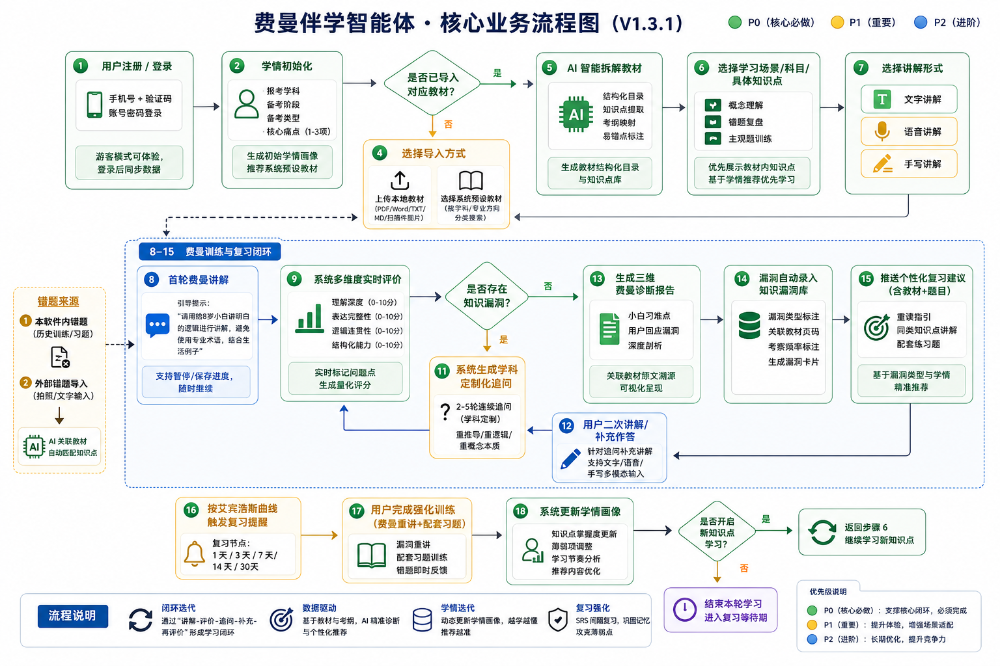
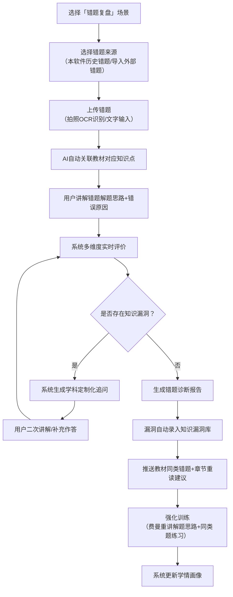
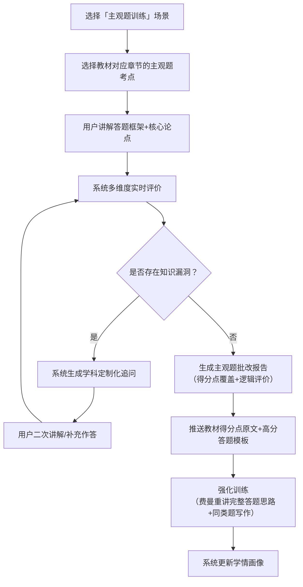
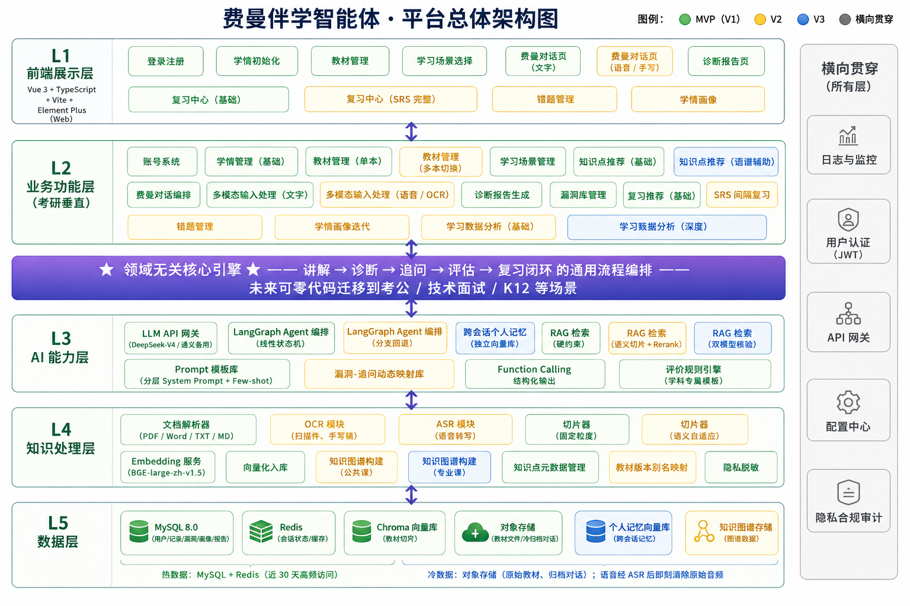
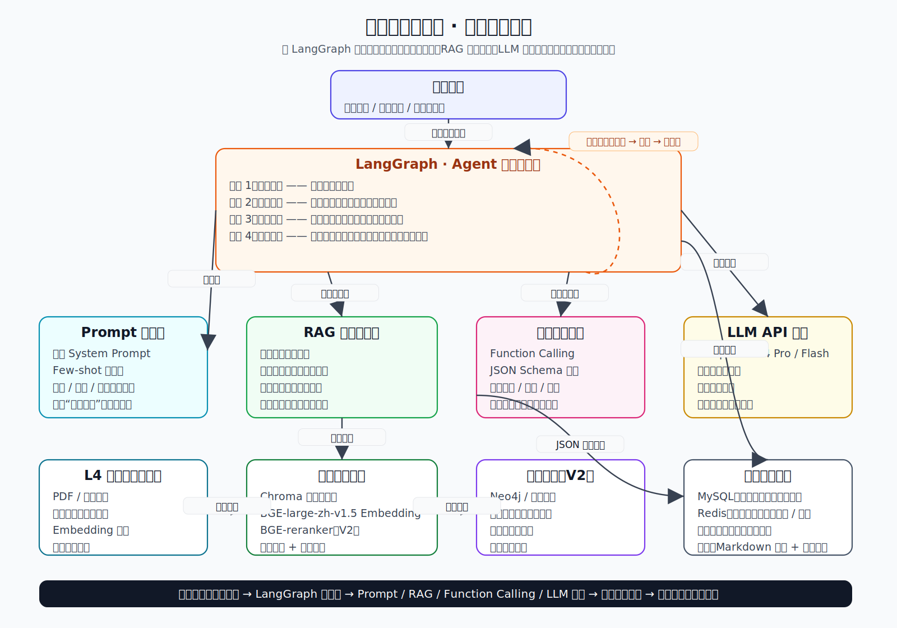

# 费曼伴学智能体平台第二周研究成果整合文档

## 目录

1. 项目整体任务说明

2. 功能流程设计

3. 平台总体架构设计

4. 技术开发难点分析

5. 技术实现总图与方案

6. 整体研究总结

---

# 一、项目整体任务说明

## 1\.1 研究背景与目标

本次围绕 \\*\\* 费曼伴学智能体（考研专属）\\*\\* 开展系统设计工作，依托费曼学习法 “输出倒逼输入、互动查漏、自主复盘” 核心逻辑，打造适配考研人群的 AI 学习工具。本周核心目标：完成平台功能流程梳理、系统架构设计、技术难点拆解、技术路线规划，形成完整可落地的设计方案，支撑后续开发工作。

## 1\.2 本周核心任务要求

1. 梳理平台**核心功能与用户完整使用流程**，输出业务流程图；

2. 设计平台**分层总体架构**，明确各层级职责与模块划分；

3. 分析项目落地过程中的**核心技术难点**，提出分级解决思路与风险预案；

4. 确定整体**技术路线与实现方案**，绘制技术实现总图，建立技术与难点的对应关系。

## 1\.3 团队分工

- 本人：负责 **Task1 功能流程设计**

- 组员：负责 Task2 平台架构、Task3 技术难点、Task4 技术实现方案及整体任务统筹

---

# 二、Task1 功能流程设计（V1\.3\.1）

## 2\.1 核心业务流程图

### 2\.1\.1 分支场景流程图

#### （1）错题复盘场景

TODO

#### （2）主观题训练场景

TODO

## 2\.2 功能优先级定义

- **P0（核心必做）**：支撑费曼学习核心闭环，产品上线必备功能，缺失则无法满足考研核心需求；

- **P1（重要）**：优化使用体验、强化考研场景适配的扩展功能；

- **P2（进阶）**：长期迭代功能，用于提升产品竞争力的增值能力。

## 2\.3 全功能清单详情

|功能模块|功能点|优先级|功能描述|
|---|---|---|---|
|账号与学情|注册 / 登录|P0|支持手机号 \+ 验证码、账号密码登录；第三方登录预留迭代接口；支持游客模式|
||学情初始化|P0|填写报考学科、备考阶段、备考类型、核心痛点，生成初始学情画像|
|教材导入与解析|系统预设考研教材选择 |P0|内置公共课、主流专业课考研官方教材、高频备考教辅资源，支持用户直接选择对应教材快速启用学习，无需自主上传，适配考研基础备考场景|
||多格式资料自主导入|P1|支持本地上传（PDF/Word/TXT/MD/ 图片）自定义学习资料，单文件≤100MB，满足个性化资料拓展需求|
||教材结构化解析|P1|对用户自主上传的资料自动生成交互式目录，扫描件通过 OCR 转为可编辑文本，结构化梳理资料内容|
||教材知识点与考纲映射|P0|针对系统预设考研教材，精准匹配考研大纲，标注高频考点、考察题型、近 5 年考察频率|
||教材易错点自动标注|P0|结合考研真题数据，为系统预设教材标注易混淆知识点、高频错题对应位置|
||多教材管理|P1|支持多本预设教材、自定义上传资料的导入与快速切换|
|内容选择|学习场景选择|P0|提供概念理解、错题复盘、主观题训练三大考研核心学习场景|
||知识点选择|P0|优先展示当前预设教材知识点，支持多维度筛选；无教材则启用通用考研知识点库|
|用户讲解|文字讲解输入 |P0|核心基础输入方式，支持用户文字输入知识点讲解内容，配套草稿保存、内容编辑能力，满足基础费曼讲解需求|
||语音讲解输入|P1|支持语音实时转写讲解内容，适配快速口述知识点的学习场景，优化讲解输入体验|
||手写讲解输入|P2|支持手写内容OCR识别录入，适配公式推导、手写笔记讲解等进阶学习场景，为后期迭代增值功能|
|AI 交互|实时多维度评价|P0|实时检测概念、逻辑、内容漏洞，输出量化评分与问题标记|
||学科定制化追问|P0|数学重推导、政治重逻辑、专业课重概念，单次生成 2\-5 轮追问|
|诊断输出|三维费曼诊断报告|P0|包含小白刁难点、用户回应漏洞、深度剖析三大模块，附带教材溯源|
|复习闭环|知识漏洞库管理|P0|自动录入漏洞，标注漏洞类型、教材页码、考察频率等信息|
||个性化复习建议|P0|推送教材重读指引、同类知识点、配套练习题|
||SRS 间隔复习|P0|基于艾宾浩斯曲线，设置 1/3/7/14/30 天复习节点|
|学情迭代|学情画像更新|P0|根据训练结果更新知识点掌握度、薄弱项，动态调整推荐内容|
|错题复盘|错题导入与管理|P1|支持软件内错题、外部拍照 / 文字错题两种导入方式|

## 2\.4 全业务流程分步详解

### 2.4.1 步骤 1：用户注册 / 登录（P0）

- **输入**：手机号 \+ 验证码、账号密码

- **功能要求**：

  1. 支持游客模式浏览核心功能，但无法保存学习记录和导入教材；

  2. 登录后自动同步历史学习数据、已导入教材和知识漏洞库；

  3. 暂不支持微信、QQ 等第三方登录，预留接口供后续迭代。

- **输出**：进入个人学习主页

### 2.4.2 步骤 2：学情初始化（P0）

- **输入**：

  1. 基础信息：报考学科（公共课 \+ 专业课）、备考阶段（基础 / 强化 / 冲刺）、备考类型（应届 / 二战 / 在职）；

  2. 核心痛点：从预设选项（概念理解困难 / 输出薄弱 / 知识碎片化 / 盲目刷题 / 自律性差）中选择 1\-3 项。

- **功能要求**：

  1. 基于学情生成初始学习建议，如 "基础阶段跨考用户，建议优先导入目标院校指定教材，重点进行概念理解训练"；

  2. 自动推荐对应学科的系统预设教材列表，支持一键选择导入。

- **输出**：初始学情画像 \+ 教材导入引导页

### 2.4.3  步骤 3：导入教材 / 学习资料（P0）

- **导入方式选择**：

  1. **选择系统预设教材**：

     - 按学科→专业方向→教材名称三级分类展示，支持关键词搜索；

     - 包含主流考研指定教材、官方大纲解析、历年真题解析；

     - 选择后自动完成解析，无需上传文件。

  2. **上传本地教材**：

     - 前期不完成，视乎后期节奏决定

     - 输入格式要求：

       | 资料类型 | 支持格式                           | 考研专属限制                                     |
       | -------- | ---------------------------------- | ------------------------------------------------ |
       | 文档类   | PDF、Word\(\.docx\)、TXT、Markdown | 优先支持考研指定教材、官方大纲解析、历年真题解析 |
       | 图片类   | JPG、PNG、WEBP                     | 支持教材手写笔记拍照上传，自动识别手写内容       |

- **处理逻辑**：

  1. 上传后自动进行格式校验和去重，失败时提示具体原因（如 "该教材已导入"、"扫描件清晰度不足"）；

  2. 优先解析教材的目录结构，生成可点击的章节树；

- **异常分支**：

  - 用户跳过导入：提示 "未导入教材将使用通用考研知识点库，建议导入目标院校指定教材以获得更精准的训练"，进入通用知识点选择页面；同时智能体用户个性化输入

  - 教材解析失败：提供 "手动标记章节" 功能，支持用户手动划分知识点范围。

- **输出**：教材结构化目录 \+ 解析完成提示（"已成功解析《XXX》，提取核心知识点 128 个，标注高频考点 45 个"）

### 2.3.4 步骤 4：AI 智能拆解教材知识点（P0）

- **输入**：用户选中的教材章节范围 \+ 学情画像中的学科 / 备考阶段

- **处理逻辑**：

  1. 基于 RAG 技术将教材内容切片为 "200\-500 字 / 个" 的知识点单元，保留章节层级；

  2. 每个知识点标注：教材页码、考纲要求（了解 / 掌握 / 熟练运用）、考察题型、近 5 年考察频率；

  3. 自动关联知识点间的逻辑关系，生成**教材知识图谱**（P1 功能）。

- **输出**：教材专属知识点列表（按章节 / 考点频率排序） \+ 易错点标注

### 2.3\.5 步骤 5：选择学习场景 / 科目 / 具体知识点（P0）

- **输入**：用户选择的学习场景（概念理解 / 错题复盘 / 主观题训练）、科目、知识点

- **功能要求**：

  1. 优先展示当前激活教材的知识点，标注 "高频考点"、"易错题对应" 标签；

  2. **错题复盘场景**：支持选择本软件历史错题或手动导入外部错题（拍照 / 文字），AI 自动关联教材对应知识点；

  3. 基于学情画像推荐优先学习的知识点，如 "根据你的痛点，推荐先学习『剩余价值』（高频考点，跨考易混淆）"。

- **输出**：进入费曼讲解准备页面

### 2.3\.6 步骤 6\-15：费曼训练与复习闭环

#### 步骤 6：选择讲解形式（P0）

- **输入**：用户选择讲解形式（文字 / 语音 / 手写）

- **功能要求**：

  1. **文字讲解**：支持分段编辑、实时保存草稿、基础格式排版（加粗 / 分点）；

  2. **语音讲解**：支持实时转写、暂停 / 续讲、语音回放，转写结果可编辑；

  3. **手写讲解**：支持拍照上传手写讲解稿、数学公式推导、知识框架图，系统通过 OCR 识别手写内容并解析语义，支持用户在手写内容上添加批注标注重点。

- **输出**：进入讲解输入界面

#### 步骤 7：首轮费曼讲解（P0）

- **输入**：用户以选定形式讲解目标知识点 / 错题思路 / 主观题框架

- **功能要求**：

  1. 系统给出引导提示："请用给 8 岁小白讲明白的逻辑进行讲解，避免使用专业术语，尽量结合生活例子"；

  2. 支持随时暂停讲解、保存进度，下次登录可继续。

- **输出**：用户讲解内容（文字 / 转写文字 / 手写识别结果）

#### 步骤 8：系统多维度实时评价理解情况（P0）

- **输入**：用户首轮讲解内容 \+ 导入教材原文 \+ 考研考纲要求

- **功能要求**：

  1. 所有评价均基于用户导入的教材内容，避免与教材表述冲突；

  2. 实时检测 4 个核心维度的问题，生成量化评分与问题标记；

  3. 实时标记讲解中的问题点，如 "此处提到的 ' 剩余价值 ' 定义与教材第 32 页表述不一致"；

  4. **核心评价维度定义与评分标准（0\-10 分）**：

     | 评估维度   | 核心定义                                                     | 评分区间说明                                                 |
     | ---------- | ------------------------------------------------------------ | ------------------------------------------------------------ |
     | 理解深度   | 衡量用户对知识点本质的掌握程度，是否存在概念错误、能否解释核心逻辑而非仅记忆结论 | 0\-3 分：存在核心概念错误，仅能复述表面结论，无法解释原理；         4\-6 分：无核心概念错误，能解释基本原理，但无法说明逻辑推导过程；         7\-8 分：能准确解释核心逻辑，可说明原理的适用范围；         9\-10 分：能深度理解本质，可辨析相近概念、结合场景拓展应用 |
     | 表达完整性 | 衡量用户讲解是否覆盖知识点的全部核心要素（定义、原理、适用条件、关键结论等） | 0\-3 分：覆盖核心要素占比＜30%，遗漏关键前提或结论；         4\-6 分：覆盖 30%\-60% 核心要素，遗漏 1\-2 个重要内容；         7\-8 分：覆盖 60%\-90% 核心要素，仅遗漏次要细节；         9\-10 分：完整覆盖所有核心要素，无重要遗漏 |
     | 逻辑连贯性 | 衡量用户讲解的逻辑是否清晰，是否存在前后矛盾、逻辑跳跃、因果关系混乱 | 0\-3 分：逻辑混乱，前后表述矛盾，无法形成完整逻辑链；         4\-6 分：逻辑基本通顺，但存在明显逻辑跳跃，需补充中间环节才能理解；         7\-8 分：逻辑连贯，因果关系清晰，仅存在少量非关键细节跳跃；         9\-10 分：逻辑严密，层层递进，因果关系明确，无任何逻辑漏洞 |
     | 结构化能力 | 衡量用户讲解的组织形式是否清晰，是否采用合理的结构（总分总、分点论述等）便于理解 | 0\-3 分：无任何结构，内容杂乱无章，无法区分主次；         4\-6 分：有基础结构，但分点不清晰，主次混淆；         7\-8 分：结构清晰，分点合理，主次明确；         9\-10 分：采用最优讲解结构（如先例子后原理、先总述后分述），贴合 "教小白" 的表达逻辑 |

  5. **完整评分示例（以《马克思主义基本原理概论》2025 版「剩余价值」知识点为例）**：

     - 用户首轮讲解："剩余价值就是工人创造的被资本家拿走的价值，比如工人干一天活赚 100 块，资本家赚 200 块，那 200 块就是剩余价值。"

     - 各维度得分与详细理由：

       | 评估维度   | 得分 | 评分理由                                                     |
       | ---------- | ---- | ------------------------------------------------------------ |
       | 理解深度   | 4 分 | 无核心概念错误，但未解释剩余价值的产生前提（劳动力成为商品）和本质（剩余劳动的凝结），仅用表面数字例子说明，未触及本质 |
       | 表达完整性 | 3 分 | 仅覆盖 "剩余价值是被资本家占有的价值" 这一个要素，遗漏了劳动力商品、剩余劳动、资本主义生产过程等核心要素（覆盖占比≈20%） |
       | 逻辑连贯性 | 5 分 | 逻辑基本通顺，用例子支撑结论，但未说明 "为什么资本家能无偿占有这部分价值"，存在关键逻辑跳跃 |
       | 结构化能力 | 3 分 | 无明确结构，仅零散陈述定义和例子，未区分主次，不符合 "教小白" 的递进式表达逻辑 |

     - 实时评价标记：「概念遗漏：未说明剩余价值产生的前提是劳动力成为商品；逻辑跳跃：未解释资本家占有剩余价值的制度基础（生产资料私有制）」

- **输出**：实时评价标记 \+ 问题点汇总 \+ 初步维度评分

#### 步骤 9：系统生成学科定制化追问（P0）

- **输入**：实时评价结果 \+ 学科属性

- **功能要求**：
  1. 采用学科差异化追问逻辑：

     - 数学：侧重定理推导过程、适用条件、反例验证；

     - 政治：侧重原理逻辑关系、现实应用、得分点对应；

     - 专业课：侧重概念本质、相近概念辨析、案例应用；

  2. 生成 2\-5 轮连续追问，每轮追问针对一个具体漏洞；

  3. 追问时关联教材原文，如 "根据你导入的《政治经济学》教材第 32 页，剩余价值的产生需要什么前提条件？"。

- **输出**：逐条推送的追问内容 \+ 漏洞类型标注

#### 步骤 10：用户二次讲解 / 补充作答（P0）

- **输入**：用户针对追问的补充讲解 / 修正内容

- **功能要求**：
  1. 支持用户引用教材原文进行作答；

  2. 系统实时检测补充内容，若仍存在漏洞则继续追问，直至漏洞全部暴露或用户无法作答。

- **输出**：用户补充讲解内容

#### 步骤 11：生成三维费曼诊断报告（P0）

- **输入**：用户全部讲解内容 \+ 追问与回应记录 \+ 教材原文

- **功能要求**：

  1. 生成「小白刁难点 \- 用户回应漏洞 \- 深度剖析」三维报告：

     - **小白刁难点**：指零基础听众理解该知识点时最容易产生困惑、最常追问的核心问题，是衡量讲解通俗度与完整性的关键指标；

     - **用户回应漏洞**：精准列出用户讲解中的具体问题，标注漏洞类型；

     - **深度剖析**：分析漏洞对考研得分的影响，说明正确理解方式；

  2. 「教材溯源」模块，直接标注每个漏洞对应的教材页码和原文段落；

  3. 给出 4 维度量化评分（0\-10 分）及总分。

- **输出**：完整三维诊断报告 \+ 4 维度评分结果

#### 步骤 12：漏洞自动录入知识漏洞库（P0）

- **输入**：诊断报告中的漏洞清单

- **功能要求**：

  1. 自动录入漏洞，标注以下信息：漏洞类型、关联知识点、教材页码、考察频率、错误次数；

  2. 支持用户手动添加 / 删除漏洞，修改漏洞标注信息。

- **输出**：更新后的知识漏洞库

#### 步骤 13：系统推送个性化复习建议（P0）

- **输入**：漏洞清单 \+ 学情画像 \+ 教材内容

- **功能要求**：

  1. 优先推送贴合考研复习习惯的建议：

     - 教材重读指引："重读《XXX》教材第 X 页第 X 段，重点掌握 XXX 内容"；

     - 教材配套练习："完成教材课后习题第 X 题，巩固该知识点应用"；

  2. 推送同类知识点讲解和 3\-5 道考研真题风格的强化题；

  3. 给出后续学习优先级建议。

- **输出**：个性化复习建议清单 \+ 强化题推送

#### 步骤 14：SRS 间隔复习与强化训练（P0）

- **输入**：漏洞录入时间 \+ 艾宾浩斯遗忘曲线

- **功能要求**：

  1. 按 1 天、3 天、7 天、14 天、30 天的节点推送复习提醒；

  2. **强化训练完成标准**：采用 "费曼重讲 \+ 配套习题" 的组合模式：
     - 第一步：用户对漏洞知识点进行费曼重讲，系统评分≥8 分视为理解通过；

     - 第二步：完成系统推送的 3\-5 道同类配套题，全部答对视为应用通过；

     - 两步均通过则标记为 "已掌握"，否则调整复习节点为 1 天后重新推送。

- **输出**：复习提醒 \+ 强化训练任务

#### 步骤 15：系统更新学情画像（P0）

- **输入**：强化训练结果 \+ 诊断报告评分

- **功能要求**：

  1. 更新用户各知识点的掌握度（未掌握 / 初步掌握 / 熟练掌握）；

  2. 统计用户高频漏洞类型，调整后续追问和推荐策略；

  3. 生成 "教材掌握热力图"（P1 功能），直观展示各章节的掌握情况。

- **输出**：更新后的学情画像 \+ 教材掌握热力图

## 3\. 核心流程分支说明

### 3\.1 错题复盘场景分支（适配考研刷题需求）

### 3\.2 主观题训练场景分支（适配考研主观题高分需求）

## 2\.5 交互示例（三大核心场景）

文档内提供**政治概念理解、数学错题复盘、计算机专业课主观题**三套完整模拟交互案例，完整演示引导话术、用户作答、AI 评价、追问逻辑、诊断报告、复习闭环全流程，验证功能逻辑适配考研实际使用场景。

---

# 三、Task2 平台总体架构设计（V0\.1）

## 3\.1 架构整体分层

采用**五层分层架构**设计，搭配全链路横向支撑模块；区分 🟢 MVP \(V1\)、🟡 V2、🔵 V3 迭代版本，同时划分**领域无关核心引擎**与**考研垂直业务**，支持后续跨场景复用。

TODO：技术栈不用提及 增加用户层

## 3\.2 各层级定位

1. **L1 前端展示层**：用户交互唯一入口，基于 Vue3 技术栈开发，优先 Web 端，小程序为远期规划；

2. **L2 业务功能层**：承载考研专属业务逻辑，对接 AI 能力层，串联全业务流程；

3. **L3 AI 能力层**：平台核心引擎，通用 AI 能力与业务解耦，可跨场景复用；

4. **L4 知识处理层**：对原始教材、笔记做解析、切片、向量化等加工处理；

5. **L5 数据层**：统一数据持久化，采用**冷热数据分层**：热数据（近 30 天高频数据）存 MySQL\+Redis；冷数据（原始教材、归档对话）存对象存储。

## 3\.3 领域解耦设计

|层级|领域无关（可复用）|考研垂直（领域适配）|
|---|---|---|
|L1 前端|对话框、报告通用样式|学科选择、考纲展示、考研专属页面|
|L2 业务|费曼对话基础流程|学情字段、漏洞分类、考研报告维度|
|L3 AI|Agent 状态机、RAG、Function Calling|学科专属 Prompt、考研 Few\-shot 样本|
|L4 知识处理|文档解析、切片、向量化|考纲映射、考研易错点标注|
|L5 数据|数据库、向量库基础结构|考研知识点元数据、漏洞类型枚举|

---

# 四、技术开发难点分析

## 4\.1 整体说明

结合业务流程与系统架构，梳理**六大核心技术难点**，针对每个问题分析现象、成因，并提供多套分级解决方案，匹配 V1/V2/V3 迭代节奏，同时制定全局风险管控规则。
技术基线：LLM=DeepSeek\-V4 Pro / 通义千问；Agent=LangGraph；向量库 = Chroma；Embedding=BGE\-large\-zh\-v1\.5。

## 4\.2 六大核心难点及解决方案

### 难点 1：区分机械复述与深度理解，精准判定知识点掌握程度

1. **问题描述**：无法区分 “背诵原文” 和 “自主理解讲解”；不同学科评价标准不一致；理解层级难以量化。

2. **分级方案**

    - 🟢 V1：分层 Prompt 校验，分基础、核心、深度三层校验内容，低成本快速落地；

    - 🟡 V2：Prompt \+ 知识图谱联动，校验知识点关联链路，识别碎片化记忆；

    - 🔵 V3：轻量判别小模型微调，与大模型双校验，提升判定精度。

### 难点 2：AI 扮演零基础小白，实现启发式追问（而非直接纠错）

1. **问题描述**：大模型默认扮演答疑角色，易直接给出答案、强行纠错；追问生硬、角色偏移，交互节奏失控。

2. **分级方案**

    - 🟢 V1：静态 System Prompt 强约束，写入角色禁令，每 3 轮对话重载 Prompt 防偏移；

    - 🟡 V2：漏洞 \- 追问动态映射库，漏洞与追问模板一一绑定，精准提问；

    - 🔵 V3：Agent 角色记忆隔离，独立存储角色指令，适配高频语音交互。
    
      TODO:多agent 不同角色 小白、监测漏洞 纠正

### 难点 3：规避大模型幻觉，防止编造内容、评价失真

1. **问题描述**：AI 凭空编造知识点、评价标准不稳定、溯源失效、输出格式混乱。

2. **分级方案**

    - 🟢 V1：RAG 前置硬约束 \+ Function Calling 结构化输出，强制内容锚定教材、输出标准化；

    - 🔵 V3：双模型交叉核验，主观题等高风险场景启用，双重校验结果。

3. **风控规则**：幻觉容忍阈值≤3%，超标自动冻结对应知识点评价，启动人工复盘。

### 难点 4：教材与用户讲解精准匹配，实现漏洞溯源

1. **问题描述**：用户口语化内容难以匹配书面教材；多版本教材兼容困难；切片粒度不合理影响检索精度。

2. **分级方案**

    - 🟢 V1：固定粒度切片（180token），通用适配所有文档；

    - 🟡 V2：语义自适应切片 \+ BGE\-rerank 重排，搭配教材版本别名映射表，兼容多版本资料。

### 难点 5：搭建稳定的 “讲解 — 诊断 — 追问 — 反馈” 完整学习闭环

1. **问题描述**：多轮对话状态丢失、流程卡死、模块数据脱节、交互循环异常。

2. **分级方案**

    - 🟢 V1：极简线性 LangGraph 状态机，仅保留核心节点，异常自动收尾；

    - 🟡 V2：带分支回退状态机，支持暂停、重写、跳过等操作，Redis 持久化状态；

    - 🔵 V3：独立个人记忆向量库，实现跨会话、跨日期学习闭环。

3. **风控规则**：单节点滞留超 15 分钟自动熔断会话，备份数据后生成极简报告。

### 难点 6：海量学习数据存储 \+ 生成千人千面个性化报告

1. **问题描述**：原始数据体量庞大、存储成本高；报告模板同质化，无法匹配不同考研人群；长期学习趋势难以分析。

2. **分级方案**

    - 🟢 V1：冷热数据分层存储，区分冷热数据存储介质，控制运维成本；

    - 🟡 V2：用户画像标签化，基于用户标签匹配差异化报告模板；

    - 🔵 V3：时序学习曲线 AI 推演，预测薄弱知识点演变趋势。

## 4\.3 迭代排期汇总表

|迭代版本|落地技术能力|对应架构模块|
|---|---|---|
|🟢 MVP V1|分层 Prompt、静态角色约束、RAG\+Function Calling、固定粒度切片、线性状态机、冷热分层存储|LLM 网关、LangGraph、RAG、Prompt 库、切片器、MySQL/Redis/ 对象存储|
|🟡 V2|知识图谱联动、漏洞 \- 追问映射库、语义切片 \+ Rerank、分支状态机、标签化报告|知识图谱、OCR/ASR、教材别名映射、分支型 Agent、学情画像|
|🔵 V3|小模型微调、角色记忆隔离、双模型核验、个人记忆向量库、时序数据分析|跨会话记忆、双模型 RAG、全学科知识图谱、深度数据分析|

## 4\.4 全局自动化处置规则

|风险类型|容忍阈值|自动化处置流程|
|---|---|---|
|大模型幻觉|≤3% 单会话错误率|冻结该知识点 AI 评价，后台触发人工复盘知识库|
|AI 角色偏移|≤2 次 / 单会话|第二次重载角色 Prompt，第三次直接关闭追问功能|
|知识点溯源错误|0 容忍|二次检索，2 次失败则停止诊断并提示用户自查|
|流程状态卡死|单节点滞留 \> 15min|熔断会话、备份数据、生成极简报告|

---

# 五、技术实现总图与方案

## 5\.1 核心技术选型及作用

|技术|选型方案|解决核心问题|
|---|---|---|
|大语言模型 API|DeepSeek\-V4 Pro/Flash（主）、通义千问（备用）|语义理解、评价打分、多轮追问、报告生成|
|Agent 编排框架|LangGraph（基于 LangChain）|管控多轮对话状态，实现费曼学习完整流程|
|RAG 检索增强|LangChain RAG \+ Chroma \+ BGE\-large\-zh\-v1\.5 \+ BGE\-rerankerV2|锚定教材原文，杜绝幻觉，实现精准溯源|
|Prompt 工程|分层 System Prompt \+ Few\-shot \+ Function Calling|约束 AI 角色、统一评价标准、规范输出格式|
|向量数据库|Chroma|存储教材切片向量，支撑语义检索、知识点匹配|
|知识图谱（V2 上线）|Neo4j|梳理知识点关联关系，识别碎片化学习问题|

## 5\.2 技术实现总框图

## 5\.3 单次费曼对话技术调用时序

1. 用户选择知识点 → 读取 MySQL 知识点元数据；

2. 用户开始讲解 → 内容写入 Redis 会话上下文；

3. 进入诊断节点 → 加载 Prompt 模板 → RAG 检索教材 → 调用 LLM\+Function Calling 生成诊断结果；

4. 判定存在漏洞，进入追问节点 → 加载追问模板 → 生成追问内容；

5. 用户二次作答，循环诊断 \- 追问流程，直至无漏洞 / 达轮次上限；

6. 进入报告节点 → 综合全量交互数据生成诊断报告，数据写入 MySQL；

7. 前端拉取数据，渲染报告与溯源内容。

## 5\.4 技术与开发难点对应关系

|技术|真假理解判断|AI 小白角色|规避幻觉|教材溯源|学习闭环|存储 \& 报告|
|---|---|---|---|---|---|---|
|LLM API|✔|✔|—|—|—|✔|
|LangGraph Agent|—|✔|—|—|✔✔|—|
|RAG 检索|✔|—|✔✔|✔✔|—|—|
|Prompt 工程|✔✔|✔✔|✔|—|—|✔|
|Function Calling|✔|—|✔✔|✔|—|✔|
|Chroma 向量库|—|—|✔|✔✔|—|—|
|知识图谱 \(V2\)|✔|—|—|✔|—|—|
|冷热分层存储|—|—|—|—|✔|✔✔|

> 说明：✔✔ = 核心解决方案；✔ = 辅助支撑；— = 无直接关联
> 
> 

---

# 六、整体研究总结

## 6\.1 成果汇总

本周完成**费曼伴学智能体**全链路设计，四大模块内容完整、逻辑互通：

1. **业务层面**：完成全功能定义、优先级划分、用户流程梳理，覆盖主流程 \+ 两大考研特色场景，配套真实交互案例，产品逻辑可落地；

2. **架构层面**：设计五层分层架构，实现核心引擎与考研业务解耦，规划 V1/V2/V3 迭代路线，冷热数据分离保障系统性能；

3. **技术难点**：识别六大核心技术风险，分版本提供解决方案，建立自动化风控规则，提前规避线上问题；

4. **技术方案**：明确全栈技术选型、技术协作链路、调用时序，建立技术与难点的对应关系，为开发提供明确指引。

## 6\.2 核心设计理念

1. **以考研场景为核心**：所有功能、规则、流程均围绕考研备考、刷题、主观题作答设计；

2. **费曼学习法深度落地**：坚持 “用户主讲、AI 引导”，以输出倒逼输入，拒绝直接灌输答案；

3. **迭代式开发**：优先上线 MVP 核心能力，后续版本持续优化体验、拓展进阶功能；

4. **解耦复用**：AI 核心引擎与垂直业务分离，支持未来拓展至考公、面试、K12 等场景。

## 6\.3 后续工作方向

1. 基于现有设计，拆分 MVP 版本开发任务，明确模块分工；

2. 针对 LangGraph、RAG、向量库等核心技术开展环境搭建与 Demo 验证；

3. 细化前端页面原型、数据库表结构、接口文档；

4. 针对高风险点补充测试用例，完善兜底方案。
