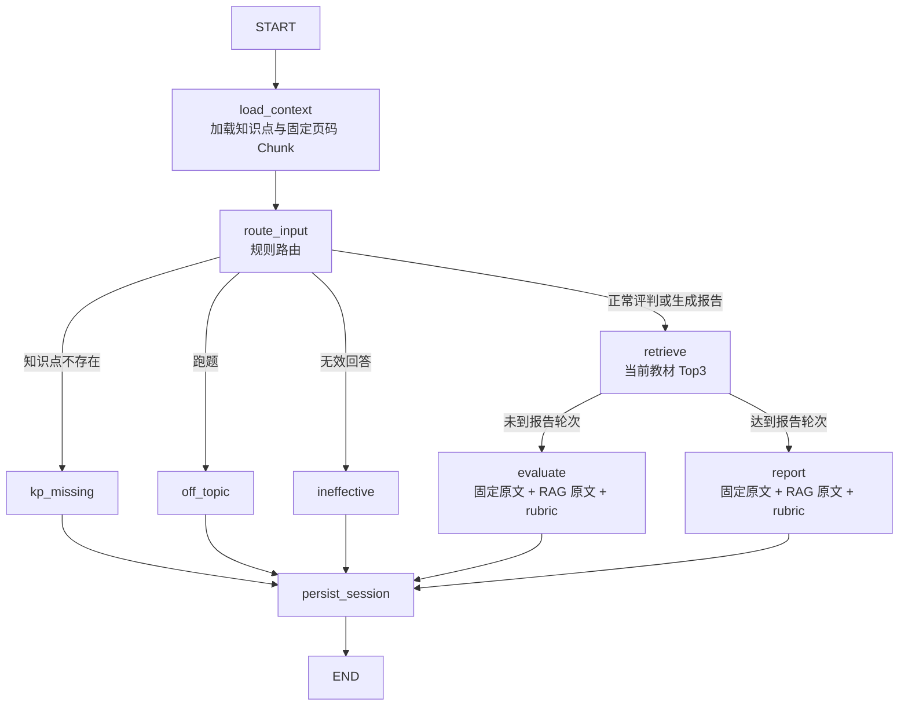

# 第五周 LangGraph RAG 改造说明

## 1. 节点流程



规则分支不调用向量检索，避免跑题和无效回答消耗 Embedding 请求。检索失败或
向量集合尚未生成时，`retrieve` 返回空的 RAG 结果，后续节点继续使用知识点固定
页码 Chunk 与四维 rubric，不阻断对话。

## 2. RAG 接口约定

LangGraph 依赖 `RAGRetriever` 协议，不直接通过 HTTP 调用本服务：

```python
async def retrieve(
    query: str,
    material_id: str,
    top_k: int = 3,
) -> list[RetrievedChunk]:
    ...
```

返回元素字段：

```json
{
  "chunk_id": "chunk-12",
  "page_no": 68,
  "text": "教材原文",
  "source": "rag",
  "score": 0.89
}
```

Backend A 完成 Chroma 服务后，在
`backend/app/services/rag_retriever.py` 的 `get_rag_retriever()` 工厂中返回
实际实现即可。当前 `NullRAGRetriever` 表示向量库未就绪状态。

## 3. Prompt 拼接顺序

1. 四维 rubric 判分基准；
2. KP 页码范围内的固定原文；
3. 当前教材内语义召回的 Top3 原文；
4. 对话轮次、行为规则与 JSON 输出契约。

固定原文与 RAG 原文按 `chunk_id` 去重。RAG 只允许在当前 `material_id` 内检索，
禁止跨教材召回。
